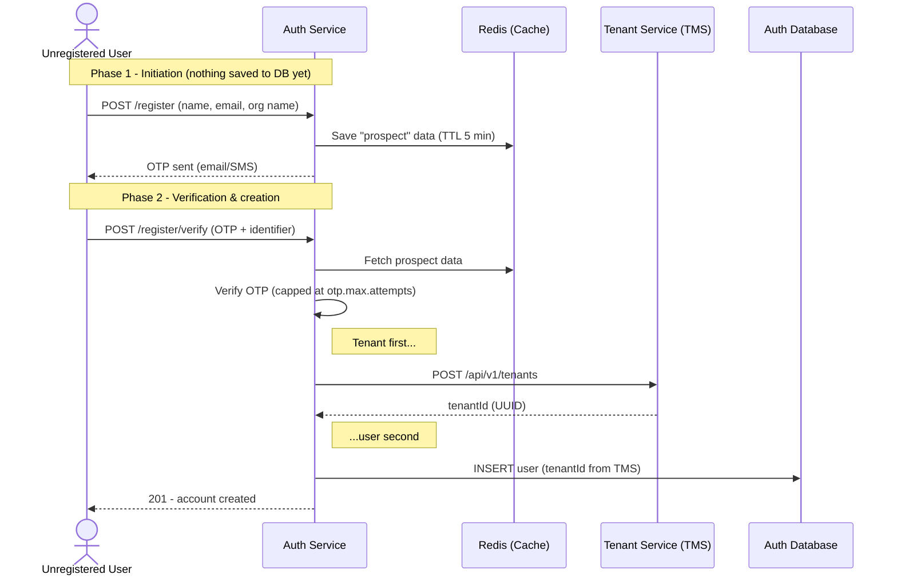

# auth-service

Authentication and identity for the IoTMining/IIoTEdge platform: login,
self-registration with OTP verification, refresh-token rotation, RBAC,
brute-force protection, and a super-admin panel. Every other service on
the platform trusts the JWTs this service issues.

See [`CHECKLIST.md`](CHECKLIST.md) for what's production-verified vs. still
open, and [`TODO.md`](TODO.md) for the reasoning behind each open item.

## Features

- **Login** — username/email + password against BCrypt-hashed
  credentials, stateless JWT access tokens plus an HttpOnly/Secure/
  `SameSite=Strict` refresh-token cookie.
- **Self-registration with OTP verification** — a two-phase flow: the
  request is staged in Redis (5 min TTL) and an OTP is sent over
  email/SMS via notification-service; only on successful verification is
  a tenant created (via tenant-management-service) and the user
  persisted. A failed user-save after the tenant call succeeds triggers
  a compensating rollback of the tenant.
- **Refresh-token rotation** — opaque, server-side tokens, rotated on
  every use, one live token per user, and IP-pinned: a refresh attempt
  from a different IP than the one the token was issued to revokes it
  and forces re-login.
- **Account lockout** — after `account.lockout.max-attempts` (default 5)
  failed logins, the account is locked for `account.lockout.duration-minutes`
  (default 15); a correct password during the lockout window is still
  rejected. Resets on the next successful login.
- **Rate limiting** — a Redis sliding-window limiter (`@RateLimited`) on
  `/login`, `/register`, `/register/verify`, and `/otp/resend`, keyed by
  client IP.
- **OTP attempt limiting** — capped at `otp.max.attempts` (default 5)
  wrong guesses per registration attempt before the OTP must be
  re-requested; resend itself is separately capped at
  `otp.resend.max.per.hour` (default 3).
- **RBAC** — `ROLE_SUPER_ADMIN` / `ROLE_ADMIN` / `ROLE_MANAGER` /
  `ROLE_USER`, enforced via Spring Security method security
  (`@PreAuthorize` and JSR-250 `@RolesAllowed`), plus explicit
  tenant-ownership checks where a path carries a `tenantId`.
  Multi-tenancy itself is delegated to tenant-management-service; this
  service only stores the `tenantId` a user belongs to.
- **Super-admin panel** — paginated user listing, revoke-access
  (deactivate + clear login data), and an enriched tenant → company →
  user tree (calls tenant-management-service, then joins in local user
  details).
- **Token cleanup** — a scheduled sweep removes expired login-history
  rows and expired refresh tokens, in bounded batches (`app.cleanup.batch-size`,
  default 500, capped at 20 batches per run so a large backlog can't turn
  one run into one long-running transaction), and safe under multiple
  replicas via [ShedLock](https://github.com/lukas-krecan/ShedLock) — without
  it, every instance would run the same sweep redundantly the moment this
  service scales beyond one. See `TODO.md` for why this isn't (yet) a
  Redis-native-TTL design instead.

## Architecture



## API reference

All routes are under `/api/v1/auth`.

| Method | Path | Auth | Notes |
|---|---|---|---|
| POST | `/login` | public, rate-limited | Returns `{accessToken}` + sets `refresh_token` cookie |
| POST | `/refresh` | cookie-based | Rotates the refresh token, IP-pinned |
| POST | `/logout` | cookie-based | Revokes the refresh token |
| GET | `/validate` | Bearer token | Token introspection - returns `X-User-Id`/`X-Tenant-Id` headers |
| POST | `/register` | public, rate-limited | Starts OTP verification, nothing persisted yet |
| POST | `/register/verify` | public, rate-limited | Creates the tenant + user on a correct OTP |
| POST | `/otp/resend` | public, rate-limited | Capped at `otp.resend.max.per.hour` |
| POST | `/users` | `ROLE_ADMIN`/`ROLE_SUPER_ADMIN` | Creates a user in the caller's own tenant |
| POST | `/tenants/{tenantId}/users` | `ROLE_SUPER_ADMIN` | Creates a user in an arbitrary tenant |
| GET | `/tenants/{tenantId}/users-list` | authenticated | Own tenant only, unless `ROLE_SUPER_ADMIN` |
| GET | `/super-admin/getUserDetails` | `ROLE_SUPER_ADMIN` | Paginated user listing |
| POST | `/super-admin/revokeUser` | `ROLE_SUPER_ADMIN` | Deactivates a user and clears their login data |
| GET | `/super-admin/tenant-companies-users-details` | `ROLE_SUPER_ADMIN` | Enriched tenant → company → user tree |

```bash
curl -X POST http://localhost:8051/api/v1/auth/login \
  -H "Content-Type: application/json" \
  -d '{"username": "jane.doe", "password": "S3cure!Pass"}'
```

Error responses (`GlobalExceptionHandler`) are `{timestamp, status, error, message}`,
except login/registration outcomes, which return `{statusCode, message, data?}`
in the response body with the same value mirrored as the HTTP status.

## Configuration reference

| Property | Default | Purpose |
|---|---|---|
| `jwt.secret` | *(required, no fallback in prod)* | Base64 HMAC-SHA key |
| `app.jwt.expiration-min` / `app.jwt.admin-expiration-min` | 30 / 1440 | Access token TTL (minutes) |
| `app.jwt.refreshExpirationMs` | 604800000 (7 days) | Refresh token TTL |
| `admin.seed.email` / `admin.seed.password` | *(email has a default; password required, no fallback in prod)* | Initial super-admin seed account |
| `account.lockout.max-attempts` / `.duration-minutes` | 5 / 15 | Brute-force lockout |
| `otp.max.attempts` | 5 | Wrong-guess cap per OTP |
| `otp.resend.max.per.hour` | 3 | Resend budget per prospect |
| `rate.limit.max-requests` / `.time-window` | 10 / 1 (minute) | Sliding-window limiter |
| `cors.allowed-origins` | profile-specific | CSV of allowed origins |
| `tenant.service.url` / `notification.service.url` | - | Downstream service URLs |
| `spring.redis.host/port/password/ssl/timeout` | - | Redis connection (custom `RedisConfig`, not Boot's `spring.data.redis.*` auto-config) |
| `app.cleanup.token-interval` | 300000 (5 min, ms) | How often the token-cleanup sweep runs |
| `app.cleanup.batch-size` | 500 | Rows deleted per batch in the sweep (capped at 20 batches/run) |
| `eureka.client.service-url.defaultZone` | profile-specific | Dev's fallback includes local basic-auth creds for convenience; prod has none - see `application-{dev,prod}.yml` |

## Known limitations

See [`TODO.md`](TODO.md) for the full list with reasoning. The two worth
knowing about before relying on this service in a new way:

- **Refresh-token reuse detection is single-token-per-user, not
  family/generation tracking.** Rotation deletes-and-replaces the one
  live row per user; a stolen-then-used token just makes the legitimate
  user's next refresh fail with "not found" rather than raising an
  explicit "reuse detected, revoke everything" alarm. IP pinning is the
  actual first line of defense here.
- **No password-reset flow and no MFA on login** - self-registration and
  admin-created users exist; OTP exists only for registration
  verification, not as a second login factor.

## Quality Gates & Production Readiness

Every `mvn verify` runs the full quality pipeline. A failure in any gate fails the build.

| Gate | Tool | Threshold |
|---|---|---|
| Build environment | Maven Enforcer | Java ≥ 21, Maven ≥ 3.6.3, no duplicate dependencies |
| Unit tests | JUnit 5 / Mockito / AssertJ | 157 tests, zero failures |
| Coverage | JaCoCo | ≥ 85% instructions, ≥ 65% branches (logic classes) |
| Static & security analysis | SpotBugs + FindSecBugs | Zero unsuppressed findings (Medium+, effort Max) |

### Commands

```bash
mvn test                       # tests + coverage report (target/site/jacoco/index.html)
mvn verify                     # everything above, gates enforced
mvn spotbugs:gui               # browse SpotBugs findings interactively
```

### SonarQube

The scanner plugin is inherited from the root pom (server: `sonar.host.url`, default
`http://localhost:9000`). Coverage (JaCoCo XML) and SpotBugs reports are wired in via
properties in this module's pom.

```bash
# one-time: start a local server
docker compose -f ../../infrastructure/sonarqube/docker-compose.yml up -d

# analyze (token from SonarQube > My Account > Security)
mvn clean verify sonar:sonar -Dsonar.token=<TOKEN>
```

### Dependency CVE audit

OWASP Dependency-Check is configured in the `security-audit` profile (fails on CVSS ≥ 7).
It needs an [NVD API key](https://nvd.nist.gov/developers/request-an-api-key) and several
minutes on first run, so it is meant for CI or an explicit local run:

```bash
mvn -Psecurity-audit dependency-check:check -Dnvd.api.key=$NVD_API_KEY
```

### Suppression policy

`spotbugs-exclude.xml` holds two kinds of entries: permanent rule noise
(Spring DI / Lombok `EI_EXPOSE_REP*`) and a **baseline** of pre-existing findings pinned
to specific classes. The same bug in new code still fails the build. When you fix a
baselined issue, delete its entry — the baseline only shrinks.
